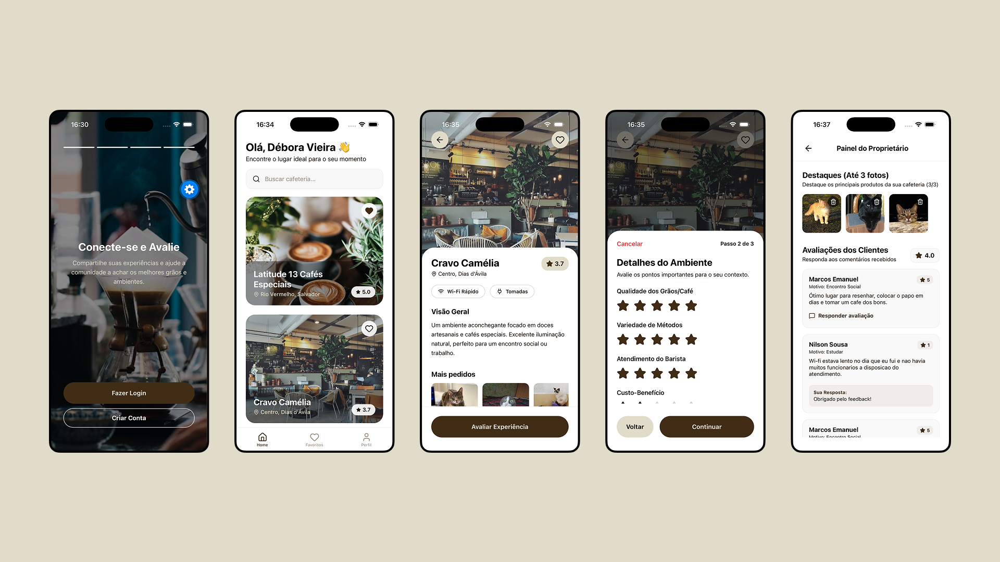

# Coffwork ☕💻

**Coffwork** é um aplicativo focado em ajudar apreciadores de café, estudantes e trabalhadores remotos a encontrar, avaliar e salvar cafeterias com base em suas experiências.

Em vez de avaliações genéricas de 1 a 5 estrelas, o aplicativo busca avaliar aspectos que realmente importam para diferentes tipos de visita: **a internet é boa para trabalhar? O ambiente é silencioso para estudar? O café especial vale o preço? Existem tomadas disponíveis?**

O projeto é composto pelo aplicativo mobile **Coffwork** e pelo backend **[Beanio](https://github.com/devmarquinhos/beanio)**, responsável pelas regras de negócio, segurança e persistência dos dados.

---

## 👥 Integrantes

* **Marcos Emanuel Leite Santos**

---

## 🎯 Problema e Solução

### Problema

Encontrar uma cafeteria adequada para estudar, trabalhar ou simplesmente consumir um bom café pode ser uma tarefa difícil.

Avaliações tradicionais normalmente utilizam apenas uma nota geral ou comentários pouco específicos. Dessa forma, uma cafeteria pode possuir uma avaliação alta, mas não necessariamente ser adequada para uma pessoa que precisa de **Wi-Fi estável, tomadas disponíveis e um ambiente silencioso para trabalhar ou estudar**.

Além disso, proprietários de cafeterias precisam de uma forma simples de apresentar seus estabelecimentos e interagir com os clientes que deixam avaliações.

### Solução

O Coffwork propõe uma plataforma especializada em cafeterias, permitindo que os usuários avaliem diferentes aspectos do estabelecimento de acordo com o **contexto de sua visita**.

As avaliações podem considerar características específicas da experiência, enquanto os proprietários podem gerenciar informações e destaques da cafeteria e responder às avaliações dos clientes.

Dessa forma, o aplicativo aproxima **cafeterias e pessoas que procuram um local adequado para café, estudo e trabalho**.

---

## 🚀 Funcionalidades

### 📱 Usuários

* **Avaliação progressiva:** experiência de avaliação dividida em 3 etapas, com critérios específicos de acordo com o contexto da visita.
* **Avaliação por contexto:** diferentes tipos de visita podem priorizar diferentes características da cafeteria.
* **Detalhes da cafeteria:** visualização de informações e características como Wi-Fi e disponibilidade de tomadas.
* **Métricas da cafeteria:** apresentação das avaliações e médias calculadas pelo sistema.
* **Destaques:** visualização das principais fotos da cafeteria.
* **Favoritos:** possibilidade de salvar cafeterias preferidas.

### 🏢 Proprietários

* **Gestão de destaques:** upload de até 3 fotos diretamente da galeria para representar os destaques do estabelecimento.
* **Visualização de avaliações:** proprietários podem consultar as avaliações recebidas.
* **Resposta às avaliações:** possibilidade de responder aos comentários deixados pelos clientes.

### ⚙️ Regras de negócio

O sistema também possui regras específicas para manter a qualidade das avaliações:

* As avaliações são associadas ao **contexto da visita**.
* No contexto `REMOTE_WORK`, por exemplo, são considerados critérios como velocidade do Wi-Fi e disponibilidade de tomadas.
* No contexto `COFFEE_TASTING`, são priorizados aspectos como qualidade do grão e técnica do barista.
* O backend recalcula a média e o total de avaliações da cafeteria quando uma nova avaliação é criada.
* Um usuário não pode realizar múltiplas avaliações para a mesma cafeteria, no mesmo contexto, durante o mesmo dia.

---

## 🛠️ Tecnologias

### Backend — Beanio

* **Java 17+**
* **Spring Boot**
* **Spring Data JPA**
* **Hibernate**
* **PostgreSQL**
* **Spring Security**
* **RESTful API**

O [Beanio](https://github.com/devmarquinhos/beanio) concentra as regras de negócio, persistência dos dados e mecanismos de segurança da aplicação.

### Frontend — Coffwork

* **React Native**
* **Expo**
* **TypeScript**
* **Expo Router**
* **Zustand**
* **Lucide Icons**
* **Animated**, nativo do React Native

O frontend é responsável pela interface mobile e pela comunicação com a API disponibilizada pelo Beanio.

---

## 💾 Estratégia de Armazenamento

O sistema utiliza o **PostgreSQL** como banco de dados relacional, acessado pelo backend através do **Spring Data JPA** e do **Hibernate**.

A persistência é centralizada no backend, mantendo o aplicativo mobile responsável principalmente pela apresentação das informações e interação com o usuário.

Entre os dados armazenados estão informações relacionadas às cafeterias, avaliações, usuários e demais entidades necessárias para o funcionamento da aplicação.

As imagens utilizadas pelos estabelecimentos também são gerenciadas através do backend, permitindo que os proprietários façam upload de até 3 fotos de destaque.

---

## 🧩 Metodologia de Desenvolvimento

O desenvolvimento do projeto é realizado de forma **incremental**, dividindo o sistema em funcionalidades e evoluindo cada parte conforme as necessidades do projeto.

A aplicação segue uma arquitetura cliente-servidor, com responsabilidades separadas entre o aplicativo mobile e o backend.

As regras de negócio são centralizadas na API, enquanto o aplicativo mobile é responsável pela interface e pela interação com o usuário.

Essa separação permite que cada camada tenha responsabilidades bem definidas, facilitando a manutenção e a evolução do sistema.

---

## 📸 Imagens das Telas



---

## ▶️ Instalação e Execução

### Pré-requisitos

É necessário possuir instalado:

* Java 17 ou superior;
* Maven;
* Node.js;
* npm ou Yarn;
* Expo;
* PostgreSQL.

### 1. Backend — Beanio

Clone o repositório:

```bash
git clone https://github.com/devmarquinhos/beanio.git
```

Entre na pasta do backend:

```bash
cd beanio/backend
```

Configure as variáveis necessárias no `application.properties` ou `.env`, incluindo as configurações do banco de dados e o segredo utilizado pelo JWT.

Execute a aplicação:

```bash
./mvnw spring-boot:run
```

### 2. Frontend — Coffwork

A partir da pasta do frontend, instale as dependências:

```bash
cd ../frontend
npm install
```

Ou, utilizando Yarn:

```bash
yarn install
```

Inicie o Expo:

```bash
npx expo start
```

Por fim, configure a `baseURL` utilizada pelo aplicativo para apontar para o endereço da máquina onde o Spring Boot está sendo executado.

Por exemplo, através da variável:

```env
EXPO_PUBLIC_API_URL=http://SEU_IP:PORTA
```

> **Atenção:** ao executar o aplicativo em um dispositivo físico,`localhost` normalmente não aponta para o computador que está executando o backend. Nesse caso, utilize o IP local da máquina.

---

## ⚠️ Limitações

Apesar de implementar as principais funcionalidades propostas, o projeto possui algumas limitações:

* A experiência depende da disponibilidade da API backend e da conexão com a internet.
* A qualidade das informações sobre uma cafeteria depende das avaliações realizadas pelos usuários.
* O sistema de avaliação ainda possui um conjunto limitado de critérios e contextos.
* O armazenamento e gerenciamento de imagens possui a limitação de até 3 fotos de destaque por estabelecimento.
* A execução local exige configuração manual do endereço da API e das variáveis de ambiente.

---

## 🔮 Melhorias Futuras

Como possíveis evoluções para o projeto, destacam-se:

* Implementação de **busca e filtros avançados** de cafeterias.
* Recomendações personalizadas com base no perfil e histórico do usuário.
* Melhorias no sistema de avaliação, adicionando novos critérios e contextos.
* Evolução das métricas e estatísticas apresentadas aos proprietários.
* Melhorias na gestão de imagens dos estabelecimentos.
* Implementação de recursos de localização e descoberta de cafeterias próximas.
* Evolução do painel de gerenciamento dos proprietários.
* Melhorias na experiência de navegação e interface do aplicativo.
